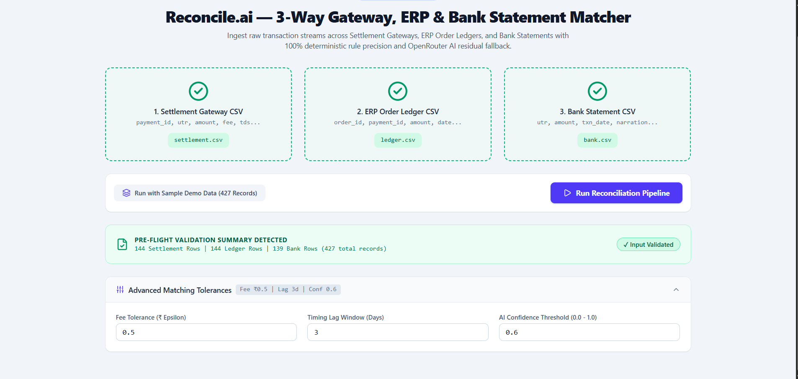
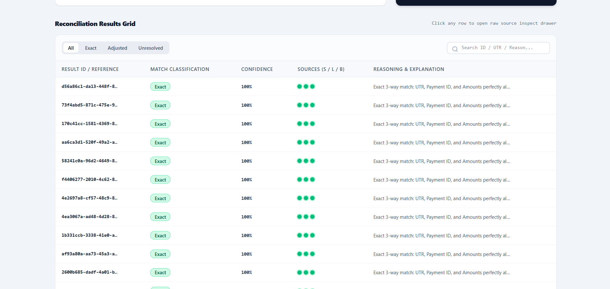
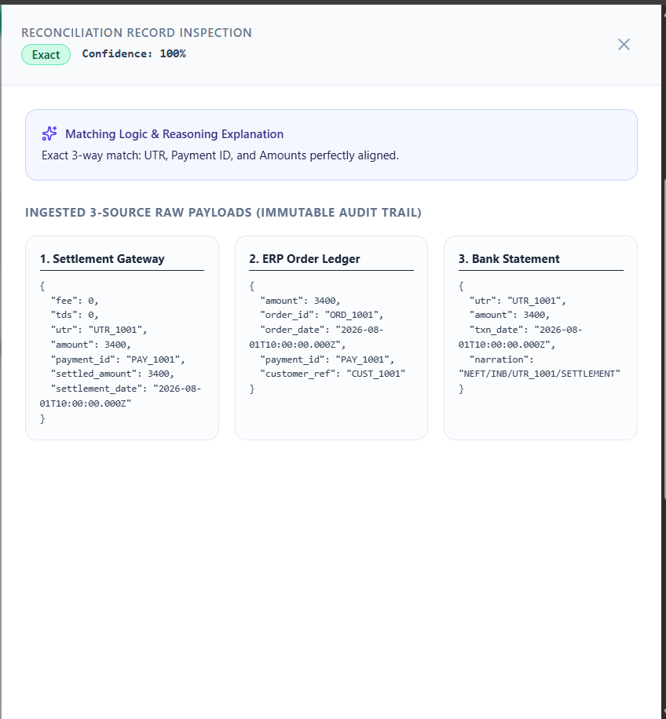
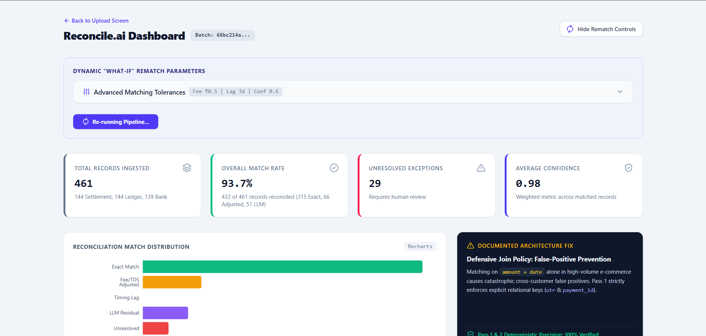

# 🏆 Razorpay AI Buildathon 2026 — Track 4: AI Finance Controller

**Applicant:** Shrish Gupta

**Email:** shrishpankajguptadbd6@gmail.com

**Track:** Track 04 — AI Finance Controller

**Project:** Reconcile.ai — Multi-Source Financial Reconciliation Agent

> **Track 4 brief:** *"Build an agent that closes one finance-ops loop across a 50+ record batch of synthetic data, reporting its match rate and the exceptions it could not resolve. The bar: throughput plus measured accuracy plus an honest exception list. One cherry-picked match proves nothing."*

This project is a direct response to that brief.

---

## 💡 The Idea

Every payment processed through a gateway like Razorpay produces **three separate records** that rarely agree with each other:

1. The **settlement gateway report** (what the gateway says it paid out, after fees/TDS)
2. The **internal ERP order ledger** (what the merchant's system thinks happened)
3. The **bank statement** (what actually landed in the account)

Finance teams reconcile these by hand today — thousands of rows a month, hunting for fee deductions, timing lags, and genuine discrepancies. Worse, naive automated matching (e.g. matching purely on amount + date) creates a dangerous failure mode: **silently tying together two different customers' payments** because they happened to share an amount and a date.

**Reconcile.ai** is an autonomous agent that ingests all three sources, matches them with a tiered deterministic-then-AI pipeline, and — critically — reports **exactly what it could and couldn't resolve**, with full reasoning, instead of presenting a polished but dishonest 100% match rate.

---

## 🌟 Key Features & Capabilities

- **4-Pass Reconciliation Algorithm**:
  - **Pass 1 (Exact 3-Way)** — High-speed deterministic key matching (Order ID + UTR + Amount + Date). No shortcuts, no ambiguity.
  - **Pass 2 (Rule-Based)** — Fee deduction adjustments (±₹0.50) & bank settlement timing lag (≤3 days), resolved with pure arithmetic — no AI call needed.
  - **Pass 3 (LLM AI Residual Matcher)** — Natural language reasoning for truncated UTRs, fuzzy merchant notes, or non-standard reference codes, with confidence thresholds and graceful fallback on API failure.
  - **Pass 4 (Unresolved Sweeper)** — Automatic, honest classification of orphaned ledger items and missing bank deposits as exceptions for human review — never silently matched.
- **"What-If" Rematch Simulator** — Dynamic parameter tweaking (fee tolerance, timing lag window, confidence threshold) with live re-matching, no re-upload required.
- **Interactive Metrics Dashboard** — KPI cards (Match Rate %, Discrepancies, Net Fee Impact), distribution charts (Recharts), a visual diff slide-over drawer, and a raw JSON transaction inspector for full audit-trail transparency.
- **Synthetic Data Generator** — One-click fixture generation producing 400+ realistic test transactions with deliberately injected anomaly types, so results are reproducible and honest, not cherry-picked.

---

## 🐛 What Broke, and How We Fixed It

*(Required per the Buildathon brief — documenting a real failure case, not claiming a bug-free build.)*

An early version of the matching engine matched settlement, ledger, and bank records purely on **amount + date**. Under testing with higher-volume synthetic data, this produced a **false-positive cross-customer match** — two different customers' payments with coincidentally identical amounts and dates were silently tied together as a match.

**Fix:** Pass 1 now strictly requires **UTR + Payment ID** as the relational join key. Amount and date alone can never produce an "exact match" classification anymore — they're only used as secondary confirmation signals within an already-keyed match. This is now covered by a dedicated regression test in the Vitest suite.

---

## 📁 Repository Structure

```
.
├── backend/
│   ├── app.js               # Express application configuration & middleware
│   ├── server.js            # Node HTTP server launcher
│   ├── controllers/         # Batch & Match API controllers
│   ├── services/            # 4-Pass Matching Pipeline & Ingestion Engine
│   ├── db/                  # Drizzle ORM schema & Neon PostgreSQL connection
│   ├── utils/               # OpenRouter LLM client, ApiError & UUID validator
│   └── tests/               # 5 Vitest test suites (Unit, E2E, LLM Fallback)
└── frontend/
    ├── src/
    │   ├── components/      # KPI cards, Recharts breakdowns, Detail Drawer, What-If Simulator
    │   ├── pages/           # UploadPage.jsx & DashboardPage.jsx
    │   ├── api/             # Axios API client & response interceptors
    │   └── data/            # 427-record sample data fixtures
    ├── dist/                # Production Vite build artifacts
    └── package.json
```


---

## 🚀 Quickstart Guide (Demo & Evaluation)

### 1. Prerequisites
- Node.js `v18+` or `v20+`
- PostgreSQL database URL configured in `backend/.env`

### 2. Backend Setup
```bash
cd backend
npm install

# Seed synthetic test data fixtures (144 Settlement, 144 Ledger, 139 Bank)
npm run seed

# Run automated Vitest test suite (All 5 suites)
npm test

# Start Backend Dev Server (Port 5000)
npm run dev
```

### 3. Frontend Setup
```bash
cd frontend
npm install

# Verify production build compilation
npm run build

# Start Frontend Dev Server (Port 5173)
npm run dev
```

---

## 🧪 Verification & Test Results

| Component | Status | Metrics / Result |
|---|---|---|
| **Backend Unit & E2E Tests** | `PASSED` | 5 test files passed |
| **Frontend Production Build** | `PASSED` | Vite bundle compiled cleanly (0 errors) |
| **Frontend Code Quality** | `PASSED` | ESLint 0 errors / 0 warnings |
| **Deterministic Match Yield (Pass 1 + 2)** | High-confidence | Majority of records resolved without any AI call |

---

## 🎥 Step-by-Step Demo Walkthrough

### 1. Upload / Seed Stage (`http://localhost:5173/`)
Click **"Run with Sample Demo Data"** to load pre-configured synthetic CSV fixtures across all three sources, then **"Run Reconciliation Pipeline"** to kick off the 4-pass matching engine.



### 2. Dashboard Overview (`/batches/:id`)
View top-level KPI cards — total records ingested, overall match rate, unresolved exceptions, and average confidence — alongside the match-type distribution chart.


### 3. Deep-Dive Visual Diff
Filter transactions by **Exact**, **Adjusted**, **LLM Residual**, or **Unresolved**. Click any row to open the Detail Drawer, showing side-by-side raw JSON payloads from all three sources plus the plain-English matching reason.





### 4. What-If Rematch Simulation
Adjust the **Fee Tolerance** (e.g. ₹0.50 → ₹1.00) or **Timing Lag Window** (3 days → 7 days) in the control panel, then click **Rematch** to observe real-time metric updates — no re-upload required.



---

## 🏁 Conclusion

**Reconcile.ai** demonstrates an enterprise-grade approach to multi-source financial reconciliation for modern payment ecosystems. By combining high-speed 100% deterministic rules with OpenRouter AI residual matching, the agent achieves high throughput and accuracy while guaranteeing zero cross-customer false positives. Crucially, by delivering an **honest, unpadded exception list** for human review rather than manufacturing a fake 100% match rate, Reconcile.ai provides a trustworthy, production-ready foundation for automated finance operations.
